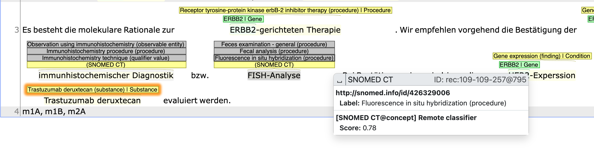

# Cross-lingual Medical Entity Linking Recommenders for INCEpTION

Simple integration of pre-configured [xMEN](https://github.com/hpi-dhc/xmen) pipelines as recommenders for (biomedical) entity linking in [INCEpTION](https://github.com/inception-project/inception).

## German SNOMED CT Linking

### Install dependencies

- `pip install -r requirements.txt` (see [here](https://github.com/hpi-dhc/xmen/issues/37) for known issues during installation of `xmen`)

### Prepare xMEN KB and index

**Option 1 (faster)**:
- Download pre-computed xMEN index and extract contents into `xmen_index`:
    - [HPI Nextcloud Link](https://nextcloud.hpi.de/s/LQM7s5oWGnoHRJ6) (password: name of this repository)

**Option 2 (more flexible)**: 
- Create xMEN files from scratch (takes about 1 hour with a GPU)
    - `git clone https://github.com/hpi-dhc/xmen`
    - `xmen dict snomed_german.yaml --code xmen/examples/dicts/umls_source.py`
    - `xmen index snomed_german.yaml --all --overwrite`

### Run the recommender

- Start the Ariadne Server (on `http://localhost:5000/xmen_snomed`):
    - `python run_snomed_german_recommender.py ./xmen_index/index`
